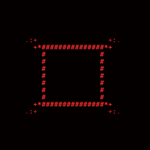
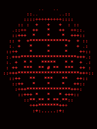
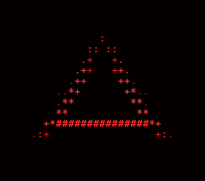

 

## Sobre mim

<table>
  <tr>
    <td align="center" width="50%">
        
      Concluindo o Ensino Médio, mirando <b>Sistemas de Informação</b> (UFPE / UFRPE / UPE)
    </td>
    <td align="center" width="50%">
        
      Construo sites e interfaces web do zero, unindo design e funcionalidade
    </td>
  </tr>
  <tr>
    <td align="center" width="50%">
        
      Código limpo, semântico e sem dependência desnecessária
    </td>
    <td align="center" width="50%">
        
      Estudando algo novo em dev o tempo todo
    </td>
  </tr>
</table>

 

## Stack

 

### Estatísticas

 

### Atividade recente

 

### Repositórios em destaque

 

### Contato

