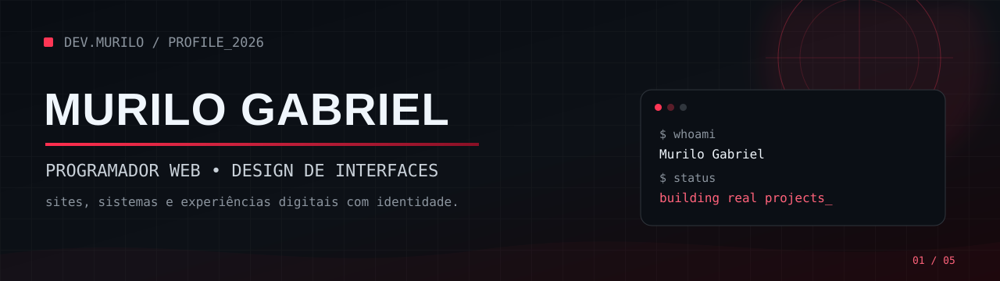
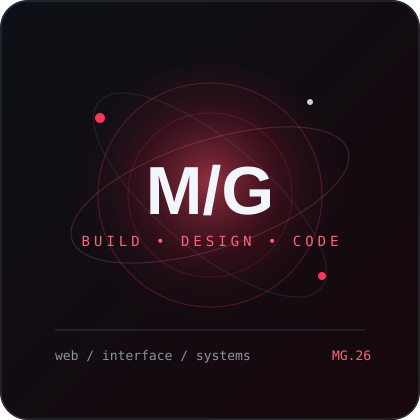

<div align="center">



<br>

# Olá, eu sou Murilo Gabriel 👋

### Programador Web & Designer de Interfaces

`transformando ideias em sites, sistemas e experiências digitais com identidade.`

[](https://murilogabriel.com.br)
[](https://devarity.com.br)

</div>

---

## `01 // SOBRE MIM`



Sou **Murilo Gabriel**, programador focado em desenvolvimento web, interfaces e sistemas que resolvem problemas reais.

Hoje estou no **3º ano do Ensino Médio** e construindo minha trajetória para cursar **Sistemas de Informação**. Paralelamente, desenvolvo projetos autorais, educacionais, institucionais e comerciais — do planejamento visual ao código e à publicação.

Também faço parte da **Devarity**, onde trabalho com desenvolvimento e design de sites para negócios e projetos que precisam de uma presença digital mais profissional.

<br>

```txt
> foco atual: desenvolvimento web + sistemas
> gosto de: interfaces com personalidade e boa experiência
> estudando: front-end, back-end e arquitetura de projetos
> próximo passo: Sistemas de Informação
```

<br clear="right"/>

---

## `02 // AGORA`

<table>
  <tr>
    <td width="50%" valign="top">
      <b>◆ Devarity</b><br>
      Desenvolvimento de websites e soluções digitais para negócios e projetos.
    </td>
    <td width="50%" valign="top">
      <b>◆ Entre Tempos</b><br>
      Revista eletrônica escolar com conteúdo, gestão e identidade própria.
    </td>
  </tr>
  <tr>
    <td width="50%" valign="top">
      <b>◆ ELO.UFRB</b><br>
      Portal institucional com páginas, conteúdos e estrutura editorial.
    </td>
    <td width="50%" valign="top">
      <b>◆ Sr. Navalha</b><br>
      Experiência web para barbearia com foco em apresentação e agendamento.
    </td>
  </tr>
</table>

---

## `03 // TECNOLOGIAS`

<div align="center">


</div>

---

## `04 // PROJETOS EM DESTAQUE`

<div align="center">

<a href="https://github.com/DevMurilo0/EntreTempos">
  
</a>
<a href="https://github.com/DevMurilo0/ELO.UFRB">
  
</a>

<a href="https://github.com/DevMurilo0/srnavalha">
  
</a>
<a href="https://github.com/DevMurilo0/murilogabriel.com.br">
  
</a>

</div>

---

## `05 // GITHUB`

<div align="center">


</div>

---

## `06 // CONTATO`

<div align="center">

[](https://murilogabriel.com.br)
[](https://www.instagram.com/murilo_gabriell0/)
[](mailto:murilogabriel.souza0@gmail.com)

<br>

```txt
código é ferramenta. identidade é o que faz o projeto ser lembrado.
```

<sub>`DevMurilo0 / sempre construindo a próxima versão.`</sub>

</div>
