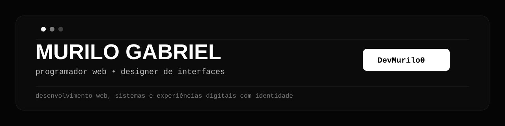

<div align="center">



<br>

# Murilo Gabriel

### Programador Web • Designer de Interfaces


<br><br>

[](https://murilogabriel.com.br)
[](https://devarity.com.br)
[](https://www.instagram.com/murilo_gabriell0/)

</div>

---

## Sobre mim

Sou **Murilo Gabriel**, programador focado em desenvolvimento web, design de interfaces e construção de sistemas com identidade própria.

Atualmente estou no **3º ano do Ensino Médio** e construindo minha trajetória para cursar **Sistemas de Informação**. Enquanto isso, desenvolvo projetos autorais, educacionais, institucionais e comerciais — passando pelo planejamento visual, desenvolvimento, publicação e evolução de cada produto.

Também faço parte da **Devarity**, trabalhando com desenvolvimento e design de experiências digitais para negócios e projetos.

```txt
> foco atual: desenvolvimento web + sistemas
> gosto de: interfaces com personalidade, clareza e boa experiência
> estudando: front-end, back-end e arquitetura de projetos
> próximo passo: Sistemas de Informação
```

---

## Projetos em destaque

<table>
  <tr>
    <td width="50%" valign="top">
      <h3>Entre Tempos</h3>
      Revista eletrônica escolar com identidade visual própria, organização editorial e ferramentas para publicação de conteúdo.
      <br><br>
      <a href="https://www.entretempos.blog.br/">site</a> ·
      <a href="https://github.com/DevMurilo0/EntreTempos">repositório</a>
    </td>
    <td width="50%" valign="top">
      <h3>Portal EREMPAF</h3>
      Portal digital da comunidade escolar, reunindo informações, páginas institucionais, séries, cardápio e comunicação.
      <br><br>
      <a href="https://portalerempaf.vercel.app/">site</a> ·
      <a href="https://github.com/DevMurilo0/portal_erempaf">repositório</a>
    </td>
  </tr>
  <tr>
    <td width="50%" valign="top">
      <h3>Devarity</h3>
      Estúdio digital voltado ao desenvolvimento de websites e sistemas sob medida para negócios, marcas e projetos.
      <br><br>
      <a href="https://devarity.com.br/">site</a>
    </td>
    <td width="50%" valign="top">
      <h3>ENEM Planner</h3>
      Ferramenta web criada para organizar rotina, planejamento e recursos de estudo para o ENEM.
      <br><br>
      <a href="https://enemplanner.vercel.app/">site</a> ·
      <a href="https://github.com/DevMurilo0/enemplanner">repositório</a>
    </td>
  </tr>
  <tr>
    <td width="50%" valign="top">
      <h3>Taiane Almeida</h3>
      Experiência editorial criada para apresentar uma obra, sua autora e seu conteúdo em uma presença digital própria.
      <br><br>
      <a href="https://taianealmeida.com.br/">site</a> ·
      <a href="https://github.com/DevMurilo0/taianealmeida">repositório</a>
    </td>
    <td width="50%" valign="top">
      <h3>Escola Peralta</h3>
      Site institucional e portal escolar com autenticação, turmas, alunos, notas, frequência e administração.
      <br><br>
      <sub>React · TypeScript · Supabase · Cloudflare</sub>
    </td>
  </tr>
</table>

---

## Tecnologias

<div align="center">


</div>

---

## Em movimento

<div align="center">


<br>

<sub>atividade transformada em movimento.</sub>

</div>

---

<div align="center">

### Contato

[](https://murilogabriel.com.br)
[](https://www.instagram.com/murilo_gabriell0/)
[](mailto:murilogabriel.souza0@gmail.com)

<br>

```txt
código, identidade e intenção.
```

<sub>DevMurilo0 • construindo uma presença digital sólida, projeto por projeto.</sub>

</div>
